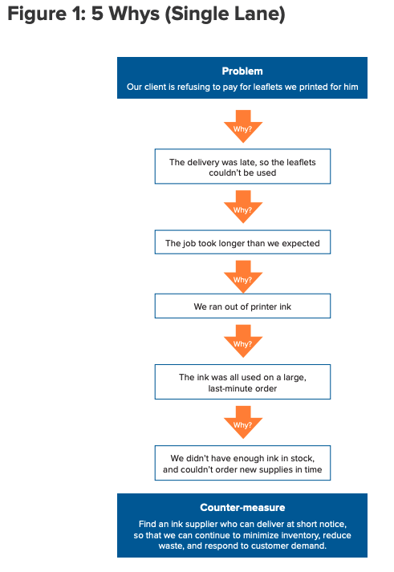
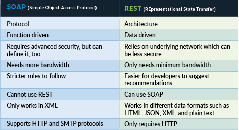

# Reading Notes
A collection of notes and take-aways throughout my Code 401 journey.
## Code 401 - Advanced Software Development

- [Articles](#articles)
- [Videos](#videos)
- [General Notes](#general-notes)

## Articles

- [Solving Problems](#solving-problems)
- [Act like you make $1000/hr](#act-like-you-make)
- [How to think like a programmer](#how-to-think-like)
- [The 5 Whys](#the-5-whys)

### Solving Problems
[source](https://simpleprogrammer.com/solving-problems-breaking-it-down/) -John Sonmez

When solving programming problems, it is important to understand the problem before you ever try to write code for a solution. The author of this article provides the following steps to follow for most problems:

1. Read the problem completely twice.
2. Solve the problem manually with 3 sets of sample data.
3. Optimize the manual steps.
4. Write the manual steps as comments or psuedo-code.
5. Replace the comments or psuedo-code with real code.
6. Optimize the real code.

The overall emphasis here is to put as much thought and attention into understanding the problem, breaking it down into manageable pieces, understanding the steps that need to happen to solve each piece, optimizing those steps for simplicity and ease of understanding.

### Act like you make $1000/hr
[source](https://medium.com/swlh/pretend-your-time-is-worth-1-000-hour-and-youll-become-100x-more-productive-f04628bb3e6d) -Anthony Moore

This article explains the benefits of spending your time wisely. The overriding suggestion is to consider your time to be worth $1000/hr, and judge each moment by whether or not is living up to that figure.

An interesting point that the author makes is that you should say "no" to things that are either not worth your time or don't work towards achieving your goals. By overextending yourself, you can take away from the things that you really need to focus on.

Another point of interest is that you should stay focused, rather than allowing yourself to get lost in something. The suggestion is that you should always strive to pay attention to what you are doing and why, so that you don't get distracted or bogged down by meaningless details. The author states "If you don't manage your time, it will manage you."

### How to think like a programmer
[source](https://www.freecodecamp.org/news/how-to-think-like-a-programmer-lessons-in-problem-solving-d1d8bf1de7d2/) -Richard Reis

Thinking like a programmer means being able to more effectively solve problems. This means avoiding common pitfalls like getting stuck in a loop of trying solutions until something fits, and establishing a framework from which you can navigate any problem, no matter the complexity.

The suggested steps are:

1. Understand

    Use whatever approach you need to in order ensure that you understand the problem. Write it out, diagram, talk it over with someone or something, do what you need.

2. Plan

    Once you understand the problem, you need to plan your solution. Take the time to identify how you can get from point a to point b. An example provided by the author is "Given input X, what are the steps necessary to return output Y?"

3. Divide

    This step is both straight-forward and essential. Break the problem into smaller, more easily solved problems, then connect the solutions together.

4. Stuck?

    If you try and try, but can't find the solution to a problem, the author three very useful suggestions:
    - Debug: Take a look at each step of your solution to ensure that it works as intended.
    - Reassess: Try approaching the problem differently.
    - Research: Chances are, someone has probably already solved a similar problem.

### The 5 Whys
[source](https://www.mindtools.com/pages/article/newTMC_5W.htm)

This article explains a method of addressing problems that require more than just a "quick fix". The overall idea is to gather a group of subject-matter experts to "go and see" the problem in action, evaluate what the problem appears to be, then ask "why?" until they get to the root of the problem. Then, an effective counter-measure can be identified and employed to prevent the problem from happening again in the future.

Here's an example they provided of what that process might look like:



A couple of useful tips that they provided are:
- The "5" is just a suggestion, more or less "why's" may be needed.
- While the immediate answer to a "why" may fall directly on someone's actions or lack thereof, the 5 Whys process enables you to keep asking why until you can find an organizational problem.

## Videos

- [what the heck is the event loop anyway](#what-the-heck-is-the)
- [The Super Mario Effect](#the-super-mario-effect)

### what the heck is the event loop anyway
[source](https://www.youtube.com/watch?v=8aGhZQkoFbQ)

This video explained how JavaScript interacts with the browser to effectively let more than one thing happen at a time. This is an important concept, because JavaScript itself can only run one thing at a time, which would potentially drastically interfere with a user's experience.

Essentially, as asynchronous callbacks are executed, they get passed to a web api, which the browser keeps track of and handles independently of the JavaScript stack. When the conditions are met for the callback, it is passed to the callback queue, where it waits its turn to be sent back to the JavaScript stack. The event loop waits until the stack is empty, then sends the first item in the callback queue to the stack.

### The Super Mario Effect
[source](https://www.youtube.com/watch?v=9vJRopau0g0)

In this video, Mark Rober explains how changing your changing your reaction to failure can ultimately lead to success. He used an example set of data that he collected to show that people who are not concerned with the negative ramifications of failure can bounce right back and try again until they get it right. He then gave many examples from his own life and experiences, reinforcing the idea that you should embrace failure and learn from it, rather than be ashamed or give up.

## General Notes

 - [Class 01 Reading](#class-01-reading)
 - [Class 02 Reading](#class-02-reading)
 - [Class 03 Reading](#class-03-reading)
 - [Class 04 Reading](#class-04-reading)
 - [Class 06 Reading](#class-06-reading)
 - [Class 07 Reading](#class-07-reading)
 - [Class 08 Reading](#class-08-reading)
 - [Class 09 Reading](#class-09-reading)
 - [Class 11 Reading](#class-11-reading)
 - [Class 12 Reading](#class-12-reading)
 - [Class 16 Reading](#class-16-reading)
 - [Class 17 Reading](#class-17-reading)
 - [Class 18 Reading](#class-18-reading)
 - [Class 19 Reading](#class-19-reading)
 - [Class 26 Reading](#class-26-reading)
 - [Class 27 Reading](#class-27-reading)
 - [Class 28 Reading](#class-28-reading)
 - [Class 31 Reading](#class-31-reading)
 - [Class 32 Reading](#class-32-reading)
 - [Class 33 Reading](#class-33-reading)
 - [Class 34 Reading](#class-34-reading)
 - [Class 36 Reading](#class-36-reading)

### Class 01 Reading

1. Describe (in plain English) what Array.map() does  
Array.map() runs each element of an array through a function, and populates a new array with the results.
2. Describe (in plain English) what Array.reduce() does  
Array.reduce() runs each element of an array through a function, producing one accumulated result.
3. Provide code snippets showing how to use superagent() to fetch data from a URL and log the result
   - With normal Promise .then() syntax
    ```javascript
    superagent.get('http://someurl')
    .then(result => {
        console.log(result)
    })
    .catch(err => console.error(err));
    ```
   - Again with async / await syntax
    ```javascript
    async () => {
        try {
            const result = await superagent.get('http://someurl');
            console.log(result);
        } catch (err) {
            console.error(err);
        }
    }
    ```
4. Explain promises as though you were mentoring a Code 301 level student  
Promises represent an asynchronous function call's "promise" to return data at some point in the future, allowing other code to be executed in the meantime. A promise can be assigned to a handler, and a pending promise can return as "fullfilled", providing a value, or "rejected", providing an error definition.
5. Are all callback functions considered to be Asynchronous? Why or Why Not?  
A callback function can be either synchronous or asynchronous, depending on how it is called.

### Class 02 Reading

1. What’s the difference between PUT and PATCH?  
PUT updates an entire resource or creates a new one if it doesn't exist, whereas PATCH updates a partial resource. Using PUT, you'd have to include all of the information in the resource, including the information that doesn't change. With PATCH, you would only have to provide the information that you want to change.
2. Provide links to 3 services or tools that allow you to “mock” an API for development like json-server
   - [JSONPlaceholder](https://jsonplaceholder.typicode.com/) - Free fake API for testing and prototyping.
   - [REQ RES](https://reqres.in/) - A hosted REST-API ready to respond to your AJAX requests.
   - [Fake JSON API](https://mocki.io/fake-json-api) - Access fake APIs with dummy data, or create your own fake JSON API.
3. Compare and contrast Swagger and APIDoc.js  
Swagger holds an entire suite of products and tools for API development, for individuals and teams alike. APIDoc.js allows for API documentation generation for comments in your source code.
4. Which HTTP status codes should be sent with each type of (un)successful API call?  
There are numerous codes in the 300's to 500's. They can be found [here](https://www.ibm.com/docs/ru/qradar-common?topic=overview-api-error-messages).
5. Compare and contrast SOAP and ReST  
Some of the major differences include security, bandwidth, and flexibility. SOAP needs more bandwidth, requires advanced security, and is overall much more strict in implementation. The following diagram was pulled from [parasoft.com](https://www.parasoft.com/blog/web-api-vs-web-services-microservices-basics-differences/)  


#### Vocabulary 02

| Term | Definition | Source |
|--|--|--|
| Web Server | "A web server is a computer that runs websites. It's a computer program that distributes web pages as they are requisitioned. The basic objective of the web server is to store, process and deliver web pages to the users." | [economictimes](https://economictimes.indiatimes.com/definition/web-server) |
| Express | "Express is a popular unopinionated web framework, written in JavaScript and hosted within the Node. js runtime environment." | [mozilla](https://developer.mozilla.org/en-US/docs/Learn/Server-side/Express_Nodejs#:~:text=Express%20is%20a%20popular%20unopinionated,web%20development%20and%20deployment%20tasks.) |
| Routing | "Routing is the process of selecting a path for traffic in a network or between or across multiple networks." | [wikipedia](https://en.wikipedia.org/wiki/Routing) |
| WRRC | Web Request Response Cycle - "The request/response cycle traces how a user's request flows through the app." | [codecademy](https://www.codecademy.com/articles/request-response-cycle-static) |

### Class 03 Reading

1. Name 3 real world use cases where you’d want to change the request with custom middleware  
Authentication, logging, error handling
2. True or false: The route handler is middleware?  
False
3. In what ways can a middleware function end the process and send data to the browser?  
With any of the response functions, such as res.send, res.json, etc.
4. At what point in the request lifecycle can you “inject” middleware?  
At any point before a request has been completed.
5. What can cause express to error with “Request headers sent twice, cannot start a second response”  
"The error "Error: Can't set headers after they are sent." means that you're already in the Body or Finished state, but some function tried to set a header or statusCode. When you see this error, try to look for anything that tries to send a header after some of the body has already been written. For example, look for callbacks that are accidentally called twice, or any error that happens after the body is sent." -from a stack overflow [response](https://stackoverflow.com/questions/7042340/error-cant-set-headers-after-they-are-sent-to-the-client)

### Class 04 Reading

1. Name 3 advantages to Test Driven Development  
More comprehensive testing, focused productivity, better modularization.
2. In what case would you need to use beforeEach() or afterEach() in a test suite?  
When you are testing data models.
3. What is one downside of Test Driven Development  
A considerable increase in work during early development.
4. What’s the primary difference between ES6 Classes and Constructor/Prototype Classes?  
According to [Justin Robertson](https://www.toptal.com/javascript/es6-class-chaos-keeps-js-developer-up), "The most important difference between class- and prototype-based inheritance is that a class defines a type which can be instantiated at runtime, whereas a prototype is itself an object instance."
5. Why REST?  
REST is highly flexible and reliable. Data is not tied to resources or methods, and data should be relatively consistent with future requests, making it easily cacheable.

#### Vocabulary 04

| Term | Definition | source |
|-|-|-|
| functional programming | "...a programming paradigm where programs are constructed by applying and composing functions. It is a declarative programming paradigm in which function definitions are trees of expressions that map values to other values, rather than a sequence of imperative statements which update the running state of the program." | [wikipedia](https://en.wikipedia.org/wiki/Functional_programming) |
| object-oriented programming (OOP) | "Object-oriented programming (OOP) is a computer programming model that organizes software design around data, or objects, rather than functions and logic." | [techtarget.com](https://searchapparchitecture.techtarget.com/definition/object-oriented-programming-OOP#:~:text=Object%2Doriented%20programming%20(OOP)%20is%20a%20computer%20programming%20model,rather%20than%20functions%20and%20logic.&text=Once%20an%20object%20is%20known,sequences%20that%20can%20manipulate%20it.) |
| class | "In object-oriented programming, a class is an extensible program-code-template for creating objects, providing initial values for state and implementations of behavior." | [wikipedia](Wikipedia) |
| super | A keyword use to call methods from a parent class. | |
| this | A keyword referring to the instance that is using it. | |
| Test Driven Development (TDD) | A style of programming wherein tests are written first, to fail, and code is written afterwards to make the tests pass. | |
| Jest | "Jest is a JavaScript testing framework designed to ensure correctness of any JavaScript codebase." | [jestjs.io](https://jestjs.io) |
| Continuous Integration (CI) | "... the practice of automating the integration of code changes from multiple contributors into a single software project." | [atlassian.com](https://www.atlassian.com) |
| REST | "REST defines a set of constraints for how the architecture of an Internet-scale distributed hypermedia system, such as the Web, should behave." Those constraints are: Client–server architecture, Statelessness, Cacheability, Layered system, Code on demand (optional), and Uniform interface. | [wikipedia](https://en.wikipedia.org/wiki/Representational_state_transfer) |
| Data Model | "an abstract model that organizes elements of data and standardizes how they relate to one another and to the properties of real-world entities." | [wikipedia](https://en.wikipedia.org/wiki/Data_model) |

### Class 06 Reading

1. Explain what a “Singleton” is (in Computer Science terms)  
A singleton is a class that can only be instantiated once.
2. Explain how the Singleton pattern can be used with Node modules, specifically with classes  
Caching with a singleton would mean that only one cache could be used/accessed at a time. Since modules are cached when they are first loaded, each module will have only one object returned each time it is called, without duplicated being made.
3. If you were tasked with building a middleware system like Express uses, what approach might you take to construct/operate it?  
Having just learned about singletons, I would use a singleton to keep track of all middleware that is implemented, ensuring that only one copy of each is implemented, no matter how many times it is used or called.

#### Vocabulary 06

| Term | Definition | Source |
|-|-|-|
| Router Middleware | "... a piece of code that comes in the middle of request and response." | [stackoverflow](https://stackoverflow.com/questions/63106648/what-is-router-middleware-in-express) |
| Dynamic Module Loading | Loading modules at run-time. |  |
| Singleton Pattern | "... a software design pattern that restricts the instantiation of a class to one "single" instance. This is useful when exactly one object is needed to coordinate actions across the system." | [wikipedia](https://en.wikipedia.org/wiki/Singleton_pattern) |
| CRUD -> REST Method Matches | Create - POST, PUT; READ - GET; Update - PUT, PATCH, POST; Delete - DELETE | [medium](https://medium.com/@ritika.atal.work/crud-mapping-to-http-verbs-354a3c0009f5) |
| Mock Testing | Using a fake resource for testing. |  |

### Class 07 Reading

* Write the following steps in the correct order:
    1. Register your application to get a client_id and client_secret
    2. Redirect to a third party authentication endpoint
    3. Ask the client if they want to sign in via a third party
    4. Receive authorization code
    5. Make a request to the access token endpoint
    6. Receive access token
    7. Make a request to a third-party API endpoint
    [source](https://auth0.com/docs/authorization/flows/authorization-code-flow-with-proof-key-for-code-exchange-pkce)
* What can you do with an authorization code?  
Good for one use, the authorization code is sent to the authorization server.
* What can you do with an access token?  
The access token is used to access information from an API.
* What’s a benefit of using OAuth instead of your own basic authentication?  
OAuth is considered more secure than basic authentication. Not only does the user not have to provide a password, potentially providing sensitive information, OAuth tokens expire after a time, requiring reauthentication.


#### Vocabulary 07

| Term | Definition | Source |
|-|-|-|
| Client ID | "The Client ID is a public identifier of your application." | [docs.microsoft](https://docs.microsoft.com/en-us/linkedin/shared/api-guide/best-practices/secure-applications) |
| Client Secret | "The Client Secret is confidential and should only be used to authenticate your application and make requests to LinkedIn's APIs." | [docs.microsoft](https://docs.microsoft.com/en-us/linkedin/shared/api-guide/best-practices/secure-applications) |
| Authentication Endpoint | "... an endpoint that is called to obtain an access token" | [ibm docs](https://www.ibm.com/docs/en/sva/10.0.0?topic=stanza-authentication-endpoint) |
| Access Token Endpoint | "... where apps make a request to get an access token for a user." | [OAuth](https://www.oauth.com/oauth2-servers/access-tokens/) |
| API Endpoint | An endpoint allowing access to information about the user being authenticated. | [auth0](https://auth0.com/docs/authorization/flows/authorization-code-flow-with-proof-key-for-code-exchange-pkce) |
| Authorization Code | Good for one use, the authorization code is sent to the authorization server. | [auth0](https://auth0.com/docs/authorization/flows/authorization-code-flow-with-proof-key-for-code-exchange-pkce) |
| Access Token | The access token is used to access information from an API. | [auth0](https://auth0.com/docs/authorization/flows/authorization-code-flow-with-proof-key-for-code-exchange-pkce) |

### Class 08 Reading

1. When is Basic Authorization used vs. Bearer Authorization?  
Basic Authorization uses a login and password, and Bearer Authorization uses tokens. Tokens allow for easy management of RBAC, as tokens can be swapped fairly easily, each bearing different roles.
2. What does the JSON Web Token package do?  
The JSON Web Token package provides a compact token format that we can use to authenticate clients, allowing us to securely send information as a JSON object.
3. What considerations should we make when creating and storing a SECRET?  
We need to make sure that it stays secret. It should be stored somewhere that it can be accessed without showing what it is, and should be ignored from any git activity. In other words, it should be placed in your .env file, which should be on your .gitignore list.

#### Vocabulary 08

| Term | Definition | Source |
|-|-|-|
| encryption | "Encryption is the process of translating plain text data (plaintext) into something that appears to be random and meaningless (ciphertext)." | [docs.microsoft](https://docs.microsoft.com/en-us/windows/win32/seccrypto/data-encryption-and-decryption) |
| token | "... an object (in software or in hardware) which represents the right to perform some operation ..." | [wikipedia](https://en.wikipedia.org/wiki/Token#:~:text=from%20Massachusetts%2C%20USA-,Computing,physical%20device%20for%20computer%20authentication) |
| bearer | The bearer of a token. |  |
| secret | Could refer to either the password used in basic authentication, or the string cipher used in encryption. |  |
| JSON Web Token | "... a proposed Internet standard for creating data with optional signature and/or optional encryption whose payload holds JSON that asserts some number of claims. The tokens are signed either using a private secret or a public/private key." | [wikipedia](https://en.wikipedia.org/wiki/JSON_Web_Token) |

### Class 09 Reading

1. What header(s) are used in authentication and authorization  
    * Basic
    * Bearer
2. What is safe to put into a JWT - [source](https://medium.com/dataseries/public-claims-and-how-to-validate-a-jwt-1d6c81823826)
    * Header - describe the cryptographic operations to the JWT data
    * Payload - contains verifiable security statements, such as the identity of the user and the permissions they are allowed
    * Signature - generated using payload and a secret key
3. How are JWTs validated - [auth0](https://auth0.com/docs/security/tokens/json-web-tokens/validate-json-web-tokens)
    1. Check that the JWT is well formed.
    2. Check the signature.
    3. Check the standard claims.

#### Vocabulary 09

| Term | Definition | Source |
|-|-|-|
| RBAC | "Role-based access control (RBAC) is a method of restricting network access based on the roles of individual users within an enterprise." | [techtarget](https://searchsecurity.techtarget.com/definition/role-based-access-control-RBAC#:~:text=Role%2Dbased%20access%20control%20(RBAC)%20is%20a%20method%20of,doesn't%20pertain%20to%20them.) |
| User Roles | User, Writer, Editor, Admin |  |
| JWT Token | "... a compact URL-safe means of representing claims to be transferred between two parties." | [jwt.io](https://jwt.io/) |

### Class 11 Reading

1. Why is access control important?  
To limit access to sensitive information or routes.
2. Describe an application that would need access control.  
Anything with user accounts.
3. What is a role used for?  
To determine if access should be granted to a group of users.
4. Why is role based access control more scalable than discretionary or mandatory access control?  
Setting new rules for access control is as easy as altering or creating a new role.

#### Vocabulary 11

| Term | Definition | Source |
|-|-|-|
| Authorization | "A subject's active role must be authorized for the subject. With rule 1 above, this rule ensures that users can take on only roles for which they are authorized." | [wikipedia](https://en.wikipedia.org/wiki/Role-based_access_control) |
| Role Based Access Control | "... a method of restricting network access based on the roles of individual users within an enterprise." | [techtarget](https://searchsecurity.techtarget.com/definition/role-based-access-control-RBAC#:~:text=Role%2Dbased%20access%20control%20(RBAC)%20is%20a%20method%20of,doesn't%20pertain%20to%20them.) |
| Capabilities | "... a communicable, unforgeable token of authority. It refers to a value that references an object along with an associated set of access rights." | [wikipedia](https://en.wikipedia.org/wiki/Capability-based_security) |

### Class 12 Reading

1. What is the benefit of transforming data into packets?  
By breaking the data into small chunks, each packet will find it's own way, allowing the data to to reach it's destination quicker. Also, the packets hold additional information.
2. UDP is often referred to as a connectionless protocol. Why is this?  
UDP does not establish a connection, meaning that it doesn't verify if the transmitted data arrives, nor if it arrives intact.
3. Can a socket server application have multiple socket connections?  
Yes, and each new connection gets a unique identifier.
4. Can a socket connection application be connected to multiple socket servers?  
Yes, if it uses multiple ports to do so.
5. Can an application be both a socket server and a socket connection?  
Yes. In fact, that's how a peer-to-pier connection is established. Each client runs both a client and a server socket.

### Vocabulary 12

| Term | Definition | Source |
|-|-|-|
| Observer Pattern | "The observer pattern is a software design pattern in which an object, named the subject, maintains a list of its dependents, called observers, and notifies them automatically of any state changes, usually by calling one of their methods." | [wikipedia](https://en.wikipedia.org/wiki/Observer_pattern) |
| Listener | Similar to observers, but more strictly listening to a very specific subject |  |
| Event Handler | A process that handles any actions that need to happen in response to an event. |  |
| Event Driven Programming | "In computer programming, event-driven programming is a programming paradigm in which the flow of the program is determined by events such as user actions, sensor outputs, or message passing from other programs or threads." | [wikipedia](https://en.wikipedia.org/wiki/Event-driven_programming) |
| Event Loop | "... a programming construct or design pattern that waits for and dispatches events or messages in a program." | [wikipedia](https://en.wikipedia.org/wiki/Event_loop#:~:text=In%20computer%20science%2C%20the%20event,or%20messages%20in%20a%20program.&text=The%20event%20loop%20is%20also,message%20pump%2C%20or%20run%20loop.) |
| Event Queue | "... a repository where events from an application are held prior to being processed by a receiving program or system." | [techopedia](https://www.techopedia.com/definition/24963/event-queue) |
| Call Stack | "... a stack data structure that stores information about the active subroutines of a computer program." | [wikipedia](https://en.wikipedia.org/wiki/Call_stack) |

### Class 16 Reading

1. Describe the Web-Request-Response-Cycle  
    "First a user gives a client a URL, the client builds a request for information (or resources) to be generated by a server. When the server receives that request, it uses the information included in the request to build a response that contains the requested information. Once built, that response is sent back to the client in the requested format, to be rendered to the user." -[backend.turing.edu](https://backend.turing.edu/module2/lessons/how_the_web_works_http)
2. Explain what a “server” is, as it relates to the WRRC  
    The server processes request and sends a response. It is the destination that the client is trying to get information from, or interact with in some manner.
3. What does it mean to “deploy” an application?  
    Deploying an application means finalizing any last steps to allow a server to connect to the internet.

### Vocabulary 16

| Term | Definition | Source |
|-|-|-|
| Server | "... a piece of computer hardware or software that provides functionality for other programs or devices, called "clients". This architecture is called the client–server model." | [wikipedia](https://en.wikipedia.org/wiki/Server_(computing)) |
| Pub/Sub | "... publish–subscribe is a messaging pattern where senders of messages, called publishers, do not program the messages to be sent directly to specific receivers, called subscribers, but instead categorize published messages into classes without knowledge of which subscribers, if any, there may be." | [wikipedia](https://en.wikipedia.org/wiki/Publish%E2%80%93subscribe_pattern) |
| WRRC | "First a user gives a client a URL, the client builds a request for information (or resources) to be generated by a server. When the server receives that request, it uses the information included in the request to build a response that contains the requested information. Once built, that response is sent back to the client in the requested format, to be rendered to the user." | [backend.turing.edu](https://backend.turing.edu/module2/lessons/how_the_web_works_http) |

### Class 17 Reading

1. Describe “The Cloud”  
    "The Cloud" refers to everything that is accessible over the internet.
2. What is a container (as it relates to computers and servers)?  
    A package containing application code and any libraries and dependencies that it might need.
3. What is auto-scaling?  
    Auto-scaling refers to the process of "automatically scaling" the resources that are required for a cloud process, based on need.
4. What is bandwidth?  
    Bandwidth is the amount of data that can pass through a connection per unit of time.
5. How do cloud providers compute service costs?  
    By resources used, be it for storage or processing.

### Vocabulary 17

| Term | Definition | Source |
|-|-|-|
| Server Instances | Server code that is allocated resources. |  |
| Containers | "... executable units of software in which application code is packaged, along with its libraries and dependencies, in common ways so that it can be run anywhere, whether it be on desktop, traditional IT, or the cloud." | [ibm.com](https://www.ibm.com/cloud/learn/containers#:~:text=Containers%20are%20executable%20units%20of,traditional%20IT%2C%20or%20the%20cloud.) |
| Cloud Services | "The cloud refers to software and services that run on the Internet, instead of locally on your computer." | [vox.com](https://www.vox.com/2015/4/30/11562024/too-embarrassed-to-ask-what-is-the-cloud-and-how-does-it-work) |
| Cloud Architecture | "...  the components and subcomponents required for cloud computing. These components typically consist of a front end platform, back end platforms, a cloud based delivery, and a network." | [wikipedia](https://en.wikipedia.org/wiki/Cloud_computing_architecture) |
| AWS | Amazon Web Services is a suite of resources that provide "on-demand cloud computing platforms and APIs to individuals, companies, and governments, on a metered pay-as-you-go basis." | [wikipedia](https://en.wikipedia.org/wiki/Amazon_Web_Services) |
| EC2/Beanstalk vs Heroku | "Heroku is container-base cloud platform offering (PaaS) whereas AWS is a secure cloud services platform providing IaaS, PaaS and SaaS. Heroku offers you a ready-to-use environment that allows you to deploy your code fast whereas the deployment process of AWS service is quite complicated." | [guru99.com](https://www.guru99.com/heroku-vs-aws.html#:~:text=KEY%20DIFFERENCE,AWS%20service%20is%20quite%20complicated.) |

### Class 18 Reading

1. What are serverless functions?  
    Serverless functions are functions that are hosted in, and executed from, the cloud.
2. If you were to create a system that emulated Lambda functions, how would you do it?  
    I woud create a database model that holds information enabling a socket infrastucture, as well as a body of text that would contain the code.
3. Describe how a CDN works  
    A CDN keeps information in multiple physical locations, reducing the transmission distance to a prospective client.

### Vocabulary 18

| Term | Definition | Source |
|-|-|-|
| Serverless Functions | "...  a programmatic function written by a software developer for a single purpose. It's then hosted and maintained on infrastructure by cloud computing companies. These companies take care of code maintenance and execution so that developers can deploy new code faster and easier." | [hubspot.com](https://blog.hubspot.com/website/serverless-functions) |
| Cloud Storage | "... a model of computer data storage in which the digital data is stored in logical pools, said to be on "the cloud". The physical storage spans multiple servers, and the physical environment is typically owned and managed by a hosting company." | [wikipedia](https://en.wikipedia.org/wiki/Cloud_storage) |
| CDN | "... A content delivery network (CDN) refers to a geographically distributed group of servers which work together to provide fast delivery of Internet content." | [cloudflare.com](https://www.cloudflare.com/learning/cdn/what-is-a-cdn/) |

### Class 19 Reading

1. Describe the similarities between AWS API Gateway + Lambda functions and an ExpressJS Server  
    They both establish routes that clients can use, and they both use functions to handle what happens when a route is hit.
2. List the AWS Database offerings and talk about the pros and cons of each  
    * RDS
        pros: Simplified disaster recovery and automatic failover
        cons: No native support as a read replica for on-premise Databases
    * DynamoDB
        * pros
            * built-in security
            * backup and restores
            * in-memory caching
        * cons
            * Deployable only on AWS and cannot be installed on individual desktops/servers.
            * Queries – Querying data is extremely limited.
            * Table Joins – Joins are impossible.
            * No Triggers.
            * No foreign keys concept to refer to other table items.
            * No server side scripts.
    * ElastiCache
        * pros:
            * fast and scalable
            * fully managed
        * cons:
            * expensive
            * not intuitive
3. What’s the difference between a FIFO and a standard queue?  
    A FIFO queue is strict about managing the items in the queue. Each item will be released from the queue once and only once. A standard queue is less strict. Each item in a standard queue will be released at least once.
4. How can the server be assured a message was properly received?  
    If the recipient sends a message back saying that it was received.

### Class 19 Vocabulary

| Term | Definition |
|-|-|
| Serverless API | An API that is hosted in the cloud. |
| Triggers | Hooks that cause an associated function to run when a watched condition occurs. |
| Dynamo vs Mongo | Dynamo is a more scalable database, whereas Mongo is more robust. |
| Dynamoose vs Mongoose | They are both modeling tools for their respective databases. |

### Class 26 Reading

1. Name 5 Javascript UI Frameworks (other than React)  
Vue.js, Angular, jQuery, Svelte, Bootstrap.
2. What’s the difference between a framework and a library?  
While both are essentially a collection of code that can be utilized, a library is mostly built and driven by you, while a framework works more "behind the scenes" to direct the flow of your application.

### Class 26 Vocabulary

| Term | Definition |
|-|-|
| Rendering | Processing information to be displayed. |
| Templates | Code that can be reused in other locations. |
| State | "the State of a component is an object that holds some information that may change over the lifetime of the component." -[geeksforgeeks](https://www.geeksforgeeks.org/reactjs-state-react/#:~:text=The%20state%20is%20an%20instance,the%20lifetime%20of%20the%20component.) |

### Class 27 Reading

1. How does React differ from vanilla JS/HTML/CSS?  
    React uses jsx to allow us to write html using javascript.
2. What is the primary difference between a function component and a class component?  
    The functional component doesn't use "this" to manage state,, but instead relies on hooks and props.

### Class 27 Vocabulary

| Term | Definition |
|-|-|
| Functional Components | A Functional component is a function that takes props and returns JSX. They do not have state or lifecycle methods. |
| Children / Child Components | Components that are called by a "parent" component. |


### Class 28 Reading

1. Why do we not need more .html pages in a multi-page React app?  

2. If we wanted a component to show up on every page, where would we put it and why?
    - Outside the <BrowserRouter/>  

    - Inside the <BrowserRouter />, outside a <Route />  

    - Inside a <Route />  

3. What does routing do with the components that were rendered when a new route is requested  

4. What does props.children contain?  

5. How do useState() and this.setState() differ?  


### Class 28 Vocabulary

| Term | Definition |
|-|-|
| State Hook |  |
| Mounting and Un-Mounting |  |

### Class 31 Reading

1. Describe use cases useState() vs useReducer()  
    UseState can handle individual states, while useReducer can handle multiple states at once.
2. Why do custom hooks need the use prefix?  
    To enable an automatic check for hook rule violations.
3. What do custom hooks usually do?  
    Custom hooks allow us to create reusable functions that use React's stateful logic.
4. Using any list of custom hooks, research and name one that you think will be useful in your applications  
    - usePermission: This hook is used to get the permission status of the browser API. Pass the API name to get the permission status. -[javascript.plainenglish.io](https://javascript.plainenglish.io/15-custom-hooks-to-make-your-react-component-lightweight-8b59b122d83a)
5. Describe how a hook that fetches API data might work  
    If you want to fetch data when the page loads, the useEffect() would be a great place for your axios call. If you want to fetch data when something happens, such as a button click or some other event, you could put the axios call in either a custom hook, or the useEffect hook listening for a change to the desired state.

### Class 31 Vocabulary

| Term | Definition |
|-|-|
| reducer | A reducer is a function that determines changes to an application's state. It uses the action it receives to determine this change. |

### Class 32 Reading

1. When you have multiple contexts, what component type should you use (class/function) and why?  
    I would imagine that functional components would be preferred.
2. What are some good use cases for using the Context API for global state?  
    Keeping track of global variables, user preferences, authentication.
3. How can you best test context?  
    Using jest, you can render the context with a component by passing in a jest.fn(). An example from stack overflow:
```js
const addItem = jest.fn()
render(
  <AppContext.Provider value={{ addItem }}>
    <MyComponent />
  </AppContext.Provider>
)
```

### Class 32 Vocabulary

| Term | Definition | Source |
|-|-|-|
| context | "...A method to pass props from parent to child component(s), by storing the props in a store(similar in Redux) and using these props from the store by child component(s) without actually passing them manually at each level of the component tree." | [geeksforgeeks](https://www.geeksforgeeks.org/context-in-react/#:~:text=React%20Context%20is%20a%20method,level%20of%20the%20component%20tree.) |
| useContext() | A hook that is used to establish the context API | []() |
| static context | "This rule applies when the static contextType property of a React component is not properly specified. The contextType property is used to consume a context created with React. When the property is specified for a React component, you can access the current value of the context using this." |  [deepscan.io](https://deepscan.io/docs/rules/react-bad-context-type) |

### Class 33 Reading

1. Why is the Context API useful?  
    It allows you to use global data without having to manually pass props between components.
2. Can a component outside of a provider get its context?  
    Yes, it just needs to import the context and consume it that way.
3. What are some common use cases for using the Context API?  
    Authentication, user settings, internal global variables.
4. Describe “Context Hell”  
    Context providers nested inside of context providers nested inside of context providers nested inside of...

### Class 33 Vocabulary

| Term | Definition |
|-|-|
| global state | State variables shared between all components. |
| global context | A way of sharing global state. |
| provider | A component that "provides" information to a consumer. |
| consumer | A component that "consumes" the information provided by a provider. |

### Class 34 Reading

1. How do bearer tokens work?  
    They are generated by the Authentication server when a user successfully authenticates. They are then passed back to the user, and used to gain access to other information.
2. Describe express middleware  
    Express middleware are functions that run before a route is hit.
3. What is a JWT?  
    "A JSON web token is an open standard that defines a compact and self-contained way for securely transmitting information between parties as a JSON object. ... Because of its relatively small size, a JWT can be sent through a URL, through a POST parameter, or inside an HTTP header, and it is transmitted quickly. A JWT contains all the required information about an entity to avoid querying a database more than once. The recipient of a JWT also does not need to call a server to validate the token." - [Auth0](https://auth0.com/docs/security/tokens/json-web-tokens)

### Class 34 Vocabulary

| Term | Definition |
|-|-|
| role based access control | Access to a resource is determined by a user's role. |
| http cookies | Used to store session information on a local machine. |

### Class 36 Reading

1. What are the advantages of storing tokens in “Cookies” vs “Local Storage”? 
    Access. Data stored in cookies is more secure, making it more ideal for token storage.
2. Explain 3rd party cookies. 
    Third party cookies are exactly what they sound like: cookies that are managed by a third party, rather than the site you are visiting.
3. How do pixel tags work?
    "A tracking pixel is a 1×1 pixel graphic that tracks web traffic, site conversions, user behavior, and more on at a site's server level. This enables ecommerce store owners to gain a deep understanding of how users interact and respond to their ads, their email campaigns, and their site as a whole." - [nexcess.net](https://www.nexcess.net/blog/what-is-a-tracking-pixel/)

### Class 36 Vocabulary

| Term | Definition |
|-|-|
| cookies | "... text files with small pieces of data — like a username and password — that are used to identify your computer as you use a computer network." - [kaspersky](https://www.kaspersky.com/resource-center/definitions/cookies#:~:text=Cookies%20are%20text%20files%20with,you%20use%20a%20computer%20network.&text=Data%20stored%20in%20a%20cookie,to%20you%20and%20your%20computer.)|
| authorization | "Authorization is a security mechanism to determine access levels or user/client privileges related to system resources including files, services, computer programs, data and application features." - [economictimes.indiatimes.com](https://economictimes.indiatimes.com/definition/authorization#:~:text=Definition%3A%20Authorization%20is%20a%20security,programs%2C%20data%20and%20application%20features.&text=Key%20factors%20contain%20user%20type,and%20related%20actions%20and%20roles.) |
| access control | "Access control is a fundamental component of data security that dictates who's allowed to access and use company information and resources." - [citrix](https://www.citrix.com/solutions/secure-access/what-is-access-control.html#:~:text=Access%20control%20is%20a%20fundamental,appropriate%20access%20to%20company%20data.) |
| conditional rendering | "Conditional rendering is a term to describe the ability to render different user interface (UI) markup if a condition is true or false." - [javatpoint](https://www.javatpoint.com/react-conditional-rendering) |

